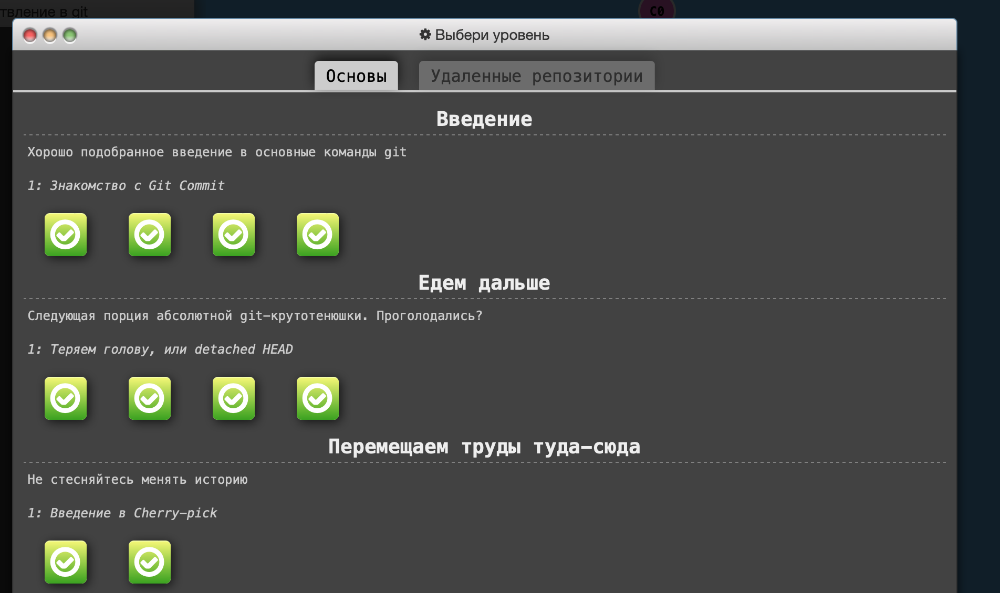
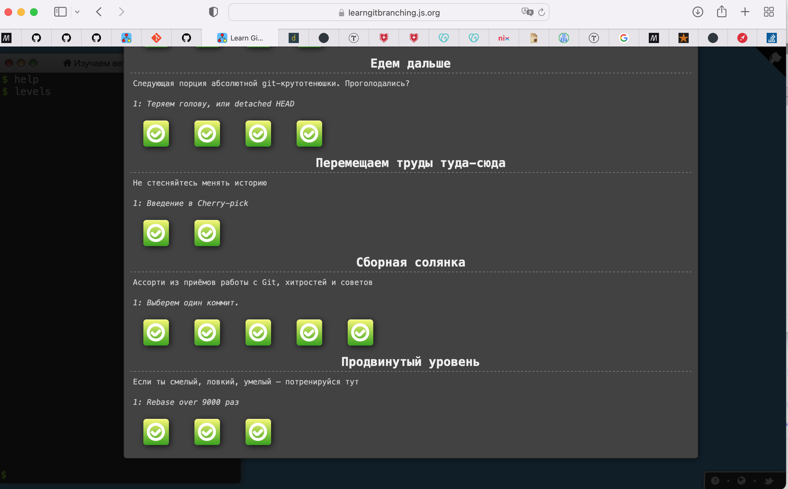
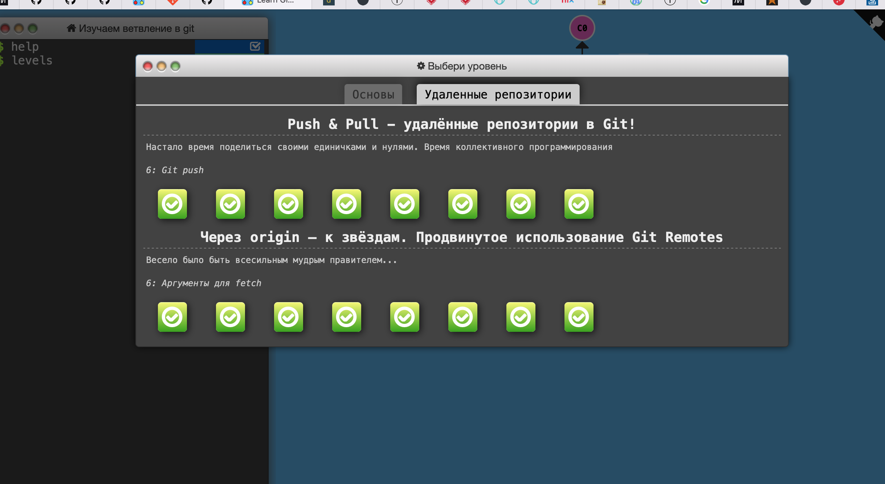

###### My study kottans-frontend

# Stage 0. Self-Study

## General
- [X] 0. [Git Basics](#git-basics) 
- [x] 1. [Linux CLI and Networking](#linux-cli-and-http)
- [x] 2. [GitHub and Collaboration](#git-collaboration)

## Front-End Basic
- [x] 3. [Intro to HTML & CSS](#intro-to-html-and-css)
- [x] 4. [Responsive Web Design](#responsive-web-design)
- [ ] 5. HTML & CSS Practice
- [ ] 6. JavaScipt Basics
- [ ] 7. Document Object Model - practice 

## Advansed Topics
- [ ]  8. Building a Tiny JS World (pre-OOP) - practice
- [ ]  9. Object oriented JS - practice
- [ ] 10. OOP exercise - practice
- [ ] 11. Offline Web Applications
- [ ] 12. Memory pair game - real project!
- [ ] 13. Website Perfomance Optimization 
- [ ] 14. Friends APP - real project!

Залишу тут як шпаргалку
[HTTP: Частина 1](https://code.tutsplus.com/uk/tutorials/http-the-protocol-every-web-developer-must-know-part-1--net-31177)
[HTTP: Частина 2](https://code.tutsplus.com/uk/tutorials/http-the-protocol-every-web-developer-must-know-part-2--net-31155)
[spec: HTML](https://html.spec.whatwg.org)

[FLEXBOX](https://fls.guru/flexbox.html)
[CSS Grid Layout](https://fls.guru/grid.html)

## Git Basics

Results

## Linux CLI and HTTP

Results

## Git Collaboration

Results

## Intro to HTML and CSS

Results

## Responsive Web Design

Results

